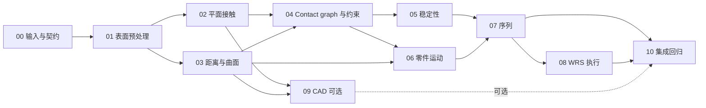

# Assembly Planner 重构：implementation plan

状态：**M1（00—03）与 M2（04—07）已实现；M3 的单/双臂模拟执行、独立回放与示例已实现**。2026-09-11。验证级别及范围见 [M2/M3 交接](m2-m3-execution.zh.md)。

最新审查：[真正六维采样、径向承载、任务尺度、作用反作用与 GPU 独立方程验证](wrench-stability-audit.zh.md)。默认改为 CUDA / wrench，修正旧生成器固定力/力矩比例的问题。

此前新增：[多方向承载极限、真实 CUDA 批量求解、M2 距离 UI 与复杂例子](stability-sweep-and-sequence-ui.zh.md)。完整旧版功能核对与尚缺项目见[asp_old 对照](old-new-feature-audit.zh.md)；当前 M2/M3 基线不等于全部旧能力或实机工作流已迁移。

主分支 UI 已合入，方向和静力 WRS 示例已增加接触面与显示控制，见[合并记录和用法](ui-merge-and-contact-display.zh.md)。

静力追加核查：[摩擦锥、受力点与独立圆锥参考](stability-validation.zh.md)；[默认力点约简、曲面回退、floating / beam 说明与计时](force-point-reduction.zh.md)。

最新更新：[Fibonacci / SOCP 方向、WRS 示例与 M2.05 静力交接](directions-and-stability.zh.md)。此前：[M1 审查与 M2.04](audit-and-m2-04.zh.md)、[Touching 判定](touching.zh.md)、[容差接触与穿入显示](tolerance-contact-and-penetration.zh.md)、[SDF 批量化](sdf-collision-and-vectorization.zh.md)。

研究补充：[装配方向、Gaussian sphere 与 assemblability](assembly-directions-literature.zh.md)，含论文、旧代码与当前实现的区别，以及[交互方向球示意](assets/direction-space.html)。这是后续设计建议，不改变当前实现状态。

进一步说明：[旧候选求解的直观解释](direction-solver-explained.zh.md)；[Assemble Them All 迁移标注](assemble-them-all-transfer.zh.md)。迁移候选已挂到 06/07，迁移后端尚未实施；SOCP 最优方向已接入独立生产 API。

历史性能实验：[Fibonacci 筛选、向量化与 SOCP/QP 对比](direction-methods-benchmark.zh.md)。当前完整 API 计时见[最新交接](directions-and-stability.zh.md)，包含归一化、退化处理和残差复核。

先看 [M1 使用方法、例子与交接](m1.zh.md) 和 [ContactModel 多后端与 SDF 设计](contact-backends.zh.md)。现已提供 mesh / SDF 两个算法后端、接触图、方向、静力、有限零件路径、带支撑资源的序列及 WRS 机器人执行验证。最新命令与实际计时见 [M2/M3 交接](m2-m3-execution.zh.md)。

目标：在第三代 WRS 中重新建立装配规划能力，以可解释、可验证的几何接触分析为基础，支持装配方向、重力稳定性、辅助夹持、序列搜索和机器人执行。

## 工作目录与基线

| 用途 | 位置 / 版本 |
| --- | --- |
| 开发仓库 | `D:\code\ch\asp\WRS2`，origin 为 `chenhaox/WRS2` |
| 开发分支 | `codex/assembly-planner` |
| WRS 基线 | `3453874438a67f6efa47bd65ac9db9fcd1d72858` |
| 上游参考 | `D:\code\ch\asp\WRS`，remote `upstream` 为 `wrslab/WRS` |
| 用户的旧仓库 | `D:\code\ch\asp\asp_old\assembly_planner`；编写计划时仍在克隆 |
| 本次实际阅读的旧源码 | `D:\code\ch\asp\assembly_planner`，`9b886441d75f7ea79eafa4cdd5dc90d3c14dbac3` |

两个 WRS 仓库在检查时具有相同 HEAD。旧源码参考副本跳过了一个名称含换行的 PDF；另有 `Test.jpg` / `test.jpg` 大小写冲突。这些 Windows 检出问题不涉及本次阅读的 `asp`、`asp_exp` 源码。不要修改用户仍在克隆的目录；后续可在克隆完成后切换参考路径并记录 commit。

每个新对话先阅读本文件、[接口约定](contracts.zh.md) 和 [M2/M3 交接](m2-m3-execution.zh.md)，再执行对应任务文档。00—08 已落地，10 的 M2/M3 使用入口与回归已落地；09 CAD 和 10 中旧数据的完整迁移仍待实施。

## 统一 Python 解释器

用户指定本项目开发、依赖检查、安装、测试、API 索引生成和示例运行统一使用：

```text
D:\code\venv312\.venv\Scripts\python.exe
```

不要依赖 PATH 中的 `python` / `pip`、`py -3.12` 或 IDE 自动选择；IDE 也指向上述路径。无需重新创建项目 `.venv`。并行 worktree 使用同一解释器，但应从各自工作目录运行并核对 `wrs.__file__`，避免共享环境中的 editable install 指向另一个 checkout；依赖安装/升级串行处理。

PowerShell 命令约定（先进入当前任务的 WRS2 checkout）：

```powershell
$assemblyPython = 'D:\code\venv312\.venv\Scripts\python.exe'
& $assemblyPython -c "import sys; print(sys.executable); print(sys.version)"
& $assemblyPython -m pip --version
# M1 测试与示例已建立：
& $assemblyPython -m unittest discover -s tests/assembly -p 'test_*.py'
& $assemblyPython examples/assembly/contact_demo.py --all
& $assemblyPython tools/gen_api_index.py
# 需要安装依赖时也通过 & $assemblyPython -m pip 调用。
```

2026-09-10 已读取该解释器及环境包元数据：Python **3.12.0**，NumPy **1.26.4**，SciPy **1.16.2**，MuJoCo **3.5.0**，wgpu **0.32.0**，rendercanvas **2.7.2**，glfw **2.10.0**，xacro **2.1.1**，urdf-parser-py **0.0.4**。这是环境快照，不代表 WRS 仿真、GPU 或所有库的运行兼容性已通过验证；本次没有安装或升级依赖。

此前“缺少 MuJoCo”的检查使用的是系统默认 Python，不适用于此指定环境。后续任务以这里的解释器为准，仍需验证纯分析模块不依赖物理/显示/CAD 的导入边界。

## 核心决策

**把 contact surface 重建为独立的几何分析层：从真实表面得到接触区域、间隙、法线场及误差，再交给不同的规划器使用。**

采用可扩展输入与算法后端、一个共同输出：

- **Mesh 后端先实现**：承接现有 STL。平面使用确定性的投影裁剪；曲面使用空间加速、表面最近点和自适应细分，显式记录无法确定的区域。
- **SDF 后端已增加**：`ContactAnalyzer("sdf")` 批量查询网格 SDF 或外部 GridSDF；输出 estimated near band，不能将其替换成 active 承载面。字段与积分 mesh 的关系、误差、预算和后端协议见 [专门设计](contact-backends.zh.md)。
- **CAD 后端按需增加**：有 STEP/B-Rep 时保留解析面、trim 边界、孔、零件实例变换和拓扑，用原始几何做接触分析。不能从 STL 无损恢复原始 CAD。
- 碰撞检测继续用于穿透检查和运动路径验证。它不负责生成 contact surface，也不能把碰撞引擎返回的少量 manifold 点解释成真实支撑区域。
- 距离很小、物理上接触、设计上配合是三种不同关系。轴孔存在正间隙时，可以有 mating relation，但不能因此在稳定性求解中凭空产生支撑力。
- 第一版不引入学习模型。几何分析和可行性验证先形成可靠基线；以后学习模型只负责候选排序，不能覆盖几何失败证据。

## 旧实现中值得保留的能力

实际入口是 `asp/sysplanner.py`，其导入的是 `asp/utils.py`，不能只看 `asp/chenlib/asp.py` 的相似副本。

| 旧源码 | 已确认行为 | 新实现处理 |
| --- | --- | --- |
| `asp/modelstructure.py::CMesh` | 面片分割；面边界转二维；把面挤出 `.05` 用于后续检测；依赖 Panda3D `base` | 保留输入几何含义，重写数据和提取算法 |
| `asp/utils.py::collisionFace` | 先 Bullet；失败时对相反法线补做 `D < 1` 平面距离判断；投影交集面积阈值 `> 30` | 全部替换为明确单位、公差和拓扑的几何分析 |
| `asp/utils.py::addcontactlookuptable` | 零件对、接触点、法线、摩擦系数的全局查找表 | 改为实例持有的 contact graph 和可追溯结果 |
| `asp/sysplanner.py::searchSequence` | 逐件安装的递归搜索，结合抓取、方向、稳定性和辅助夹持 | 保留能力目标，重新划分搜索状态和可行性接口 |
| `asp/utils.py::StabilityAnalyzer`、`asp/stabilitylib/stability.py` | 接触力、重力、wrench 及优化分析；有多种实验分支 | 先建立有明确物理假设的静力平衡基线 |
| `asp/grasps.py::check_obj_on_the_way` | 选定方向上离散检测，存在固定距离、步长及负 margin | 改为显式净空、姿态和路径验证 |
| `asp_exp/bdbody.py`、`bdmodel.py`、`bulletest.py`、`rigidbody.py` | 刚体、Bullet 和实验可视化 | 后续迁到 WRS 的物理/场景适配层 |

旧实现已经尝试过“平面距离 + 面积交集”，问题在于它只是碰撞流程中的补偿分支，且接触、绘图、缓存、单位和物理判断耦合。因此不能只把 Bullet 换成 MuJoCo，也不能只把原函数改名。

旧 `facetboundary` 的说明假定单边界；`drawIntersectionArea` 只取 exterior，遇到多个 polygon 的处理也不能完整保留所有区域。新方案必须原生表达孔、凹形区域、多块接触和线/点接触。

## 接触算法

### 1. 几何输入与预处理

输入为已装配状态下的各个独立零件：真实网格或 CAD、零件实例 ID、目标位姿、长度单位、质量/质心/摩擦及固定支撑。STL 不携带长度单位，导入时必须显式声明；旧数据的尺寸看起来采用毫米，**先验证再转米**，不按包围盒大小自动猜测。

几何计算保留局部 `float64`；渲染可以转换为 WRS 使用的类型。焊接、退化三角形清理、法线定向及非流形检查都要记录改动和原始面 ID 映射。焊接阈值不得大于希望分辨的装配间隙。

平面区域生长需要同时限制相邻法线角度、整个区域对拟合平面的最大残差及区域内法线偏差；不能只沿“法线相近”的邻接边做传递闭包。面边界保留全部外环和内环，多个不连通区域分别保存。

### 2. 空间候选筛选

先扩张零件 AABB，再筛选 patch AABB / BVH。扩张只用于候选筛选，不改变零件实际几何。排除距离下界已经大于 near 阈值的零件对，避免每个零件的每个三角形与其他所有三角形全量两两广播。

### 3. 平面接触：第一阶段的确定性基线

1. 确认两个平面区域的法线方向相对，并以几何残差约束近平行程度。
2. 在同一个局部正交平面坐标系中投影两侧**实际三角形覆盖区域**。
3. 对候选三角形进行二维凸多边形裁剪，再拼接非重叠交集单元和边界；三角形并集保留凹形和孔，不能用整个 patch 的凸包代替。
4. 在交集单元的顶点计算两侧原平面上的对应点及有向间隙。若两平面略有倾斜，间隙随位置变化，应按间隙阈值进一步裁剪，不能凭平均距离把整块面积判为接触。
5. 输出所有不连通区域、面积、质心、对应点、法线、间隙范围、原始三角形 ID 和误差界。明确区分面积接触、线接触、点接触及已分离。

这里的“确定性”针对输入多面体及声明的公差，不宣称恢复了制造后的真实接触。数值谓词不可靠、重叠重复面未处理、面片退化时必须返回诊断。

### 4. 曲面和通用网格

建立三角形 BVH，提供 point-to-triangle、triangle-to-triangle 距离和最近点证据。顶点 KD-tree 或三角形中心 KD-tree只能筛选候选，不能给出真实表面距离。

对候选区域进行双向对应查询与自适应细分，验证最近点位置、法线相对关系、表面连续性和距离变化。对一个三角形内距离使用距离函数的 Lipschitz 界或等价的保守界，只有覆盖整个单元的界才能用于排除；仅采样不到接触不能证明不存在接触。曲率大、狭小区域、薄壁和法线不连续处加密，预算耗尽保留 unresolved 区域。

输出法线场，不能把圆柱内壁和轴面的所有法线平均为一个方向。拟合的圆柱/球面只用于候选和运动方向建议，结果带残差，仍须对原网格验证。线/点接触若当前后端不能可靠重建，应返回 `unknown/unsupported`，不能偷偷当作“无接触”。

曲面的 epsilon 近接触带面积不等于物理承载面积。例如理想刚性球与平面切触是点接触，不能因距离阈值扩大就变成有限面积的支撑面。有限承载斑块需要单独的形变/材料模型；首版只报告 near 区域及其分辨率，不据此推导额外抗扭能力。

SDF 是可选的查询加速表示，不是第一版必须引入的依赖。正负号需要明确的内外定义；开放面、非流形、重叠网格等情况下不能把未经验证的 sign 用来证明无穿透。[Open3D 距离查询说明](https://www.open3d.org/docs/release/tutorial/geometry/distance_queries.html)提供了这一前提及表面最近点接口的参考。

### 5. CAD 后端

有原始 STEP 时，读取 face 类型、零件实例层级、单位、trim 及面方向。平面用实际 trim 区域交集；圆柱面检查轴线、半径差、轴向区间和角度区间；一般曲面在参数域中自适应追踪，周期 seam 要合并。

Open CASCADE 的 [BRepAdaptor_Surface](https://dev.opencascade.org/doc/refman/html/class_b_rep_adaptor___surface.html)可访问底层曲面，[BRepExtrema_DistShapeShape](https://dev.opencascade.org/doc/refman/html/class_b_rep_extrema___dist_shape_shape.html)提供最短距离和对应点。**最短距离本身不等于接触区域**，仍需实现区域重建。OCP/pythonocc 的具体版本和安装兼容性留到任务 09 在实际环境验证；作为可选依赖隔离。

### 6. 公差和接触语义

分开保存数值误差、几何重建误差、输入位姿不确定性、接触阈值、near 阈值、穿透容许量和路径净空。所有长度为米、面积为平方米、角度为弧度。不要用一个 `eps` 同时表示距离、角度、面积和力平衡残差。

为已声明误差上界的输入传播间隙区间，例如平移误差加上转角误差产生的表面位移上界；没有可信上界时标记估计，不能伪造认证精度。近接触区域不能直接进入承载力平衡；零间隙假设、支撑激活或压合动作需要另外的证据或显式模型。

## 在规划中的使用

### 装配方向与有限运动

为 A、B 间接触约定 `n_A` 是 A 的外法线，指向 B。B 上接触点的相对速度满足非穿透条件：

```text
n_A · [(v_B + ω_B × r_B) - (v_A + ω_A × r_A)] >= 0
```

所有量在同一坐标系中，r 从对应 twist 参考点指向接触点。对固定 A、纯平移 B，退化成 `n_A · v_B >= 0`。从这些单侧约束生成平移锥或六维 twist 候选，不再平均法线。

这只是局部必要条件：长槽、转角、螺纹、远处障碍和插拔顺序都需要有限路径验证。允许的 tangent/插入方向也不意味着沿整个路径均无碰撞。正间隙约束用有限间隙约束或接近时的激活规则处理，不能提前变成永久等式约束。

### 稳定性

首先做显式接触模式下的静力平衡：对每个自由零件满足力和力矩平衡，零件间内力等大反向，法向力非负，摩擦锥约束满足。采用内接多面体近似摩擦锥，用 SciPy [linprog / HiGHS](https://docs.scipy.org/doc/scipy/reference/generated/scipy.optimize.linprog.html)建立可复现基线。

面积接触用合法区域内的力作用点；不得在孔洞中生成承载点。支持点集可用来表达合力和力矩，但它不等于均匀真实压力分布。线/点接触不能凭空拥有面接触的抗扭能力。承载能力有上限时，输入压力/摩擦/夹持力模型；没有上限时只能报告所声明的理想刚体模型结果。

区分 `equilibrium_feasible` 与有恢复能力的稳定性。静力可行不保证动态稳定，也不保证扰动后不滑动；后续用有限扰动力/力矩、接触模式变化或物理仿真补充验证。辅助夹持是有资源占用和能力边界的动作，不能直接当成免费的无限刚性固定。

### 序列搜索

从装配态出发做 disassembly search，再反转为 assembly 候选序列；状态包括剩余零件、装配体位姿、固定/夹持状态及资源。失败原因和查询缓存要绑定完整状态。先做有预算的确定性 DFS/beam；结果可行性由几何、稳定性和路径模块给出。

拆得开不保证机器人能反向装回去：重抓、支撑切换、夹爪可达性都要在正向执行时重新验证。首版覆盖单件刚性拆除；成组移动留接口。螺纹、卡扣弹性和压配不是普通刚体碰撞规划自动能解决的能力，返回明确未支持的动作类型。

[Assemble Them All](https://assembly.csail.mit.edu/)和 [ASAP](https://asap.csail.mit.edu/)提供了 assembly-by-disassembly、路径、重力支撑及执行约束分层的参考。这里采用的是适合本项目的工程设计，不声称复制其算法或达到论文效果。

## 新 WRS 的实际接入点

| 现有模块 | 用法与需要处理的边界 |
| --- | --- |
| `wrs/geom/geometry.py`、`loader.py` | 复用数组/加载约定；loader 当前支持 STL/DAE；分析用 float64 数据，不使用碰撞凸包当真实表面 |
| `wrs/geom/surface.py::segment_surface` | 可参考邻接构建；当前仅相邻法线阈值，须另建带全局残差的分割 |
| `wrs/geom/ops2d.py::extract_boundary` | 当前多边界时返回空列表，不能直接用于带孔 contact patch |
| `wrs/scene/scene_object.py`、`render_model.py` | 世界 mesh 变换为 `sobj.tf @ visual.loc_tf`；必须支持多 visual 和重复实例 |
| `wrs/grasp/antipodal.py`、`reasoner.py` | 抓取候选、共同抓取和可达性；接触抽取不能依赖 grasp 模块 |
| `wrs/manipulation/arm.py::insert`、`recipe.py` | 已有直线插入组合，可作为执行原语；当前仍按碰撞门限验路径，需要有范围的允许接触策略 |
| `wrs/manipulation/workcell.py` | 多臂共享碰撞世界、辅助夹持和活动臂切换 |
| `wrs/motion/core/planning_context.py` | 当前状态空间为关节向量；碰撞缓存将关节值四舍五入到三位，不适合直接保证精密插入净空；需独立配置和最终细检 |
| `wrs/collider/mj_collider.py` | 自碰撞/抓持豁免与 `exclude` 不是 patch 级允许接触；不能全局忽略配合零件来放行插入 |
| `wrs/physics/mj_compiler.py` | 当前 inline mesh 会由 MuJoCo 建凸包，可能填平孔和凹槽；精密装配需真实 mesh 距离或经验证的凹形分解 |
| `wrs/viewer/world.py` | 显示零件、patch、法线、间隙、路径和失败证据；不承担规划状态 |

MuJoCo 的标准 mesh 碰撞使用凸几何，相关约束可查[官方 collision detection 文档](https://mujoco.readthedocs.io/en/stable/computation/index.html#collision-detection)。外部运动检查与分析模型必须对齐，否则“孔被凸包填平”会让正确插入被拒绝。

WRS 根 `__init__.py` 当前 eager import 物理、grasp、viewer 等模块。指定解释器已有 MuJoCo 等包，但任务 00 仍应解决纯分析模块的导入边界，并验证已有 `from wrs import ...` 公共入口；本轮未运行 WRS 仿真。

## 分对话实施顺序

| 任务 | 独立对话交付物 | 前置 |
| --- | --- | --- |
| [00 基础与输入](tasks/00-foundation.zh.md) | 数据模型、单位、导入边界、小型 fixture、旧数据资产清单 | 无 |
| [01 表面预处理](tasks/01-surfaces.zh.md) | 拓扑/法线/平面 patch，孔和多环 | 00 |
| [02 平面接触](tasks/02-planar-contact.zh.md) | 确定性的平面 contact region，解析验收 | 01 |
| [03 距离与曲面](tasks/03-proximity.zh.md) | BVH、距离证据、曲面近接触、自适应误差 | 01；与 02 接口一致 |
| [04 图与运动约束](tasks/04-contact-graph.zh.md) | Contact graph、mating 区分、平移/twist 候选 | 02；曲面验收需 03 |
| [05 稳定性](tasks/05-stability.zh.md) | 静力平衡、扰动检查、辅助支撑需求 | 04 |
| [06 零件运动](tasks/06-part-motion.zh.md) | 有限拆除路径、净空、预期接触策略 | 03、04 |
| [07 序列规划](tasks/07-sequence.zh.md) | 带支撑资源的拆卸搜索、装配候选、可解释失败 | 05、06 |
| [08 WRS 执行](tasks/08-wrs-integration.zh.md) | 抓取/IK/插入/多臂支撑/可视化 | 07 |
| [09 CAD 扩展](tasks/09-cad.zh.md) | 可选 STEP/B-Rep 后端，复用同一接触协议 | 02、03；可延后 |
| [10 集成与回归](tasks/10-validation.zh.md) | 可重跑基准、旧案例迁移、结果与已知边界 | 07；机器人验收需 08，CAD 验收需 09 |



02 与 03 在 01 合入之后可以并行；05 与 06 在接口稳定后可以并行；09 可作为后续独立扩展。共享 `contracts`、`model.py`、包入口、依赖声明和 API 索引的修改必须串行整合。仅“任务编号靠前”不表示其文件已存在；每个任务启动时检查实际交付。

里程碑：

- **M1：可靠接触分析（00—03），已完成**。已实现平面区域与点/线接触、曲面近接触带、BVH 距离与独立 overlap 诊断；未知/预算耗尽显式报告。适用假设与未支持场景见 M1 交接。不依赖机器人和物理仿真。
- **M2：几何与静力装配规划（04—07），已完成基线**。输出具有区间几何证据的有限对象路径、支撑事件、DFS/beam 序列及正向 replay；机器人状态仍需单独验证。
- **M3：机器人模拟执行示例（08、10 的相关验收），已完成基线**。实际 RS007L + OR2FG7 单/双臂、抓取/IK、持物碰撞、支撑接管和独立采样回放通过。验证级别为 sampled_joint_nominal_mesh；尚不包含机器人 CCD、动力学或实机执行。CAD 09 不阻塞该基线。

## 首批验收数据

先用解析几何得到可信答案，再迁旧实验；旧 planner 的输出是对照结果，不是真值。

| 案例 | 必须验证 |
| --- | --- |
| 两块 0.1 m 立方体面接触 | 面积 0.01 m²；平移/旋转整体装配体后结果不变 |
| 横向偏移 0.025 m | 面积 0.0075 m²；三角划分改变后结果一致 |
| 正间隙 / 深穿透 | 分开 near、active、interference；near 不承载 |
| 倾斜两平面 | 不把只有窄带接近误报为整面接触 |
| 方环、L 形面、两块不连通面 | 孔中无支撑点；保留全部接触区域 |
| 线接触、点接触 | measure 维度正确，不能伪造面积或抗扭能力 |
| 轴孔有间隙、同轴圆柱面 | mating 与 active contact 分开，法线场不被平均掉 |
| 完全包含、薄片穿越、狭窄通道 | 不能只用表面相交/稀疏采样证明无碰撞 |
| 开放网格、反法线、非流形 | 确定性诊断与 unknown，不误用 SDF 正负号 |
| 桌面堆叠、斜面滑动、悬空件 | 力矩/摩擦/重力及支撑激活符合解析预期 |

已用 JSON 读取和旧 loader 的文件映射检查：`domino_5` 有 **3** 个零件实例，`burrpuzzle` 有 **6** 个，所需 STL 存在。不要从 `domino_5` 文件名推断零件数。`bridge` 有 **6** 个实例，但 `asp/objects/alframe.stl` 缺失，当前不能承诺重跑。质量、摩擦、位姿误差和旧单位仍需逐项核验。

阈值边界、交换 A/B、整体刚体变换、重新三角化、网格加密和尺度转换必须进入验收。曲面结果记录收敛曲线和 unresolved 比例。性能报告区分冷启动/缓存，记录三角形数、候选数、查询预算、峰值内存和机器环境；暂不写未经测量的耗时目标。

## 跨对话交接规则

1. 每个对话打开开发仓库，读取三份文件：本计划、contracts、自己的 task。核对 branch、工作区变化和指定解释器的 `sys.executable`，保留已有工作。
2. 顺序执行时在同一开发分支推进。并行执行时从同一个**已提交**的前置基线创建独立 worktree，记录基线 commit；不能让多个对话同时切换同一目录的分支。
3. 修改范围以 task 为准。发现契约缺项，先提出最小具体修订并同步相关任务；不能另起一套同名数据类型或偷偷改单位/法线含义。
4. 每项交付实现、可复现的验收命令、实际输出和失败边界。在各 task 文档末尾记录完成 commit、契约版本及下一任务所需信息。不要把未运行的 GUI、仿真或机器人检查写成通过。
5. 新增公共 API 后运行 `& 'D:\code\venv312\.venv\Scripts\python.exe' tools/gen_api_index.py`；并行开发时由整合任务统一生成，避免整份索引相互覆盖。
6. `.gitignore` 当前广泛忽略 JSON/NPZ/图像；fixture 优先由确定性生成器创建。需要跟踪的 fixture 单独添加窄范围例外，不能依赖未跟踪的本地文件。

各 task 的启动提示词保留为设计记录，不需要重做 00—08。下一对话先读 [M2/M3 交接](m2-m3-execution.zh.md)，从其中列出的未实现扩展选择任务。

## 最新诊断

[2026-09-11：细分裁剪批量化、active、Bunny 面积与 49 个 SDF 碰撞姿态](sdf-collision-and-vectorization.zh.md)。新增独立 `SDFCollisionChecker` 和失败边界记录。

[Bunny unknown、A/B 面、STL 锯齿及性能剖析](contact-diagnostics.zh.md)：包含 1 / 0.25 / 0.1 mm 分辨率对比、批量化前后计时及下一步加速方案。
