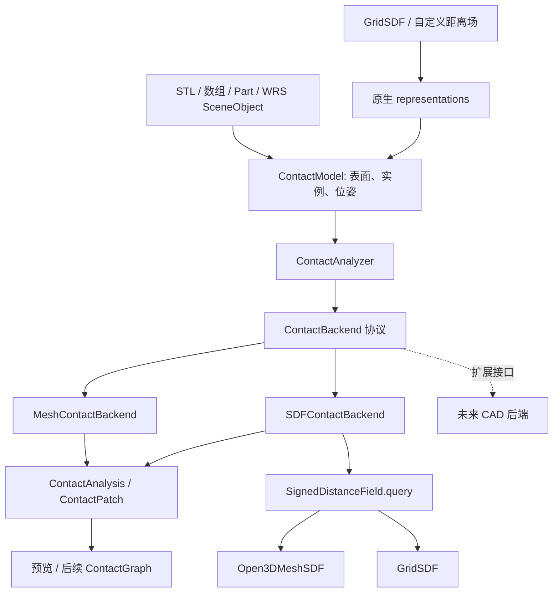

# ContactModel 多后端设计与 SDF 实现

2026-09-10。开发分支 `codex/assembly-planner`，解释器统一为 `D:\code\venv312\.venv\Scripts\python.exe`。

后续 v2 修正轴孔端部的三角形法线跳变和整单元台阶；增加真实 STL、最长边细分与分阶段计时，见 [SDF / STL 验收](sdf-stl-validation.zh.md)。下面历史面积记录对应 v1。

## 设计目标与已实现范围

把模型输入、接触算法和规划结果分开。调用方使用同一个 `ContactAnalyzer`；选择 `mesh`、`sdf` 或传入自定义 `ContactBackend` 对象。实例可复用局部几何缓存，查询位姿显式传递。当前是几何接触分析层，不包含动力学、接触力或序列规划。

已实现的输入包括 `MeshData`、带单位的 STL、顶点/三角形数组、已有 `Part`、WRS `SceneObject` 的视觉表面，以及附加在表面上的 `GridSDF` / 自定义 `SignedDistanceField`。**SDF 原生数据也需要提供一个用于面积积分的表面网格。** 当前没有实现 STEP 导入、无网格隐式曲面积分或扫描点云重建；不能把这些格式直接传进来假装已支持。



## 调用入口

```python
from wrs.assembly import (
    ContactModel, ContactAnalyzer, ContactConfig,
    SDFContactBackend, SDFConfig,
)
from wrs.assembly.primitives import cylinder, pose

tube = ContactModel(
    cylinder(radius=.015, inner_radius=.010, height=.020, sections=32),
    name="tube",
)
shaft = ContactModel(
    cylinder(radius=.0098, height=.010, sections=32), name="shaft",
)
config = ContactConfig(
    near_tol_m=.0005, surface_resolution_m=.001,
    normal_angle_rad=.55, max_cells=20000, max_triangle_tests=500000,
)
analyzer = ContactAnalyzer("sdf", config=config)
report = analyzer.analyze_pair(tube, shaft)

# 换算法；调用和输出结构相同。
mesh_report = ContactAnalyzer("mesh", config=config).analyze_pair(tube, shaft)

# 明确设置后端参数，也可以传入自定义 ContactBackend 实例。
backend = SDFContactBackend(sdf_config=SDFConfig(
    nsamples=3, max_query_points=100000, open_surface="error",
))
analyzer = ContactAnalyzer(backend, config=config)
moved_report = analyzer.analyze_pair(tube, shaft, tf_b=pose((0, 0, .001)))
# tf_b 只影响本次查询；shaft.tf 没有改变。
```

输入适配：

```python
a = ContactModel.from_file("a.stl", name="a", length_unit="mm")
b = ContactModel.from_arrays(vertices, faces, name="b", length_unit="m")
c = ContactModel.from_part(part)
d = ContactModel.from_scene_object(scene_object, name="d")
```

`SceneObject` 适配器将所有视觉网格的 `loc_tf` 合并进对象局部几何，再保留对象的世界 `tf`。它复制数据，后续场景移动不会偷偷改变本次输入。它不读取 `collisions`、凸包、球或 AABB 代理。WRS 视觉网格可能已经是 float32；适配不能恢复之前丢失的精度，精密模型优先从原始 STL/数组导入。复合视觉网格可能有自交，SDF 有符号模式会拒绝不满足实体条件的输入。

多零件：`analyzer.analyze(models, poses=...)`。如果提供 `poses`，缺失 ID 表示零件不在场，未知 ID 报错。已有 `analyze_pair(..., backend="sdf")`、`analyze_contacts(assembly, state, backend="sdf")` 也可用；旧 `MeshProximity` 调用继续兼容。需要向后端传递原生字段时使用 `ContactModel`，`Part`/assembly JSON v1 仍只保存 mesh。

## 两层后端协议

### ContactBackend：算法后端

实现 `name`、`cache_key` 和 `analyze_pair(a, tf_a, b, tf_b, *, config)`，返回 `ContactAnalysis`。这里不要求提供 BVH、三角形树或 SDF；未来 CAD 后端应实现此协议，不能继承旧 mesh 距离接口后假装兼容所有三角操作。

- `MeshContactBackend` 包装现有 M1，包括平面裁剪、曲面区域、全局实体检查。
- `SDFContactBackend` 用 SDF 积分双侧 near band，并独立记录 mesh 全局验证。
- 自定义后端直接传对象；未知名称和不兼容数据明确报错。当前不需要进程级可变注册表。

### SignedDistanceField：SDF 数据后端

实现 `cache_key`、JSON 可序列化的 `metadata`、`query(points_local_m) -> SDFSamples`。查询数组为 `(N,3)`，长度单位全部是米，**内部负、外部正**。返回值包括距离、对应点、单位法线、距离误差、有效性、符号有效性及可选 primitive ID（无三角形时为 -1）。

`ContactModel.representations["sdf"]` 可放入该协议对象；字段必须与积分网格处于同一个局部坐标系，且不能在缓存期间原地改变。现有网格/数组不可变；自定义对象的不可变性由提供方保证。

原生字段注册时检查网格顶点和三角形中心处的零集误差与定义域，发现单位、坐标或明显模型不一致即拒绝。该检查只是抽样注册验证，不是零集处处一致的证明。

## SDF 算法

1. 清理源表面，保留三角形来源、面积和拓扑。为每个目标零件独立建立字段，避免把相互穿透的多个零件放进同一符号场。
2. 在源三角形中心和顶点批量查询目标 SDF，将源世界点变换到目标局部坐标系。源单元法向取内部法向，避免共享尖角处的不唯一梯度；目标对应点和法线再变换回世界坐标系。
3. 根据距离、三角形覆盖半径和误差估计是否可能进入 near 阈值。对网格字段，还能使用目标真实三角形的凸性构造单元距离上界；有独立 mesh 距离下界时也记录并使用。这是 **SDF + 网格几何辅助界限**，不是仅依赖体素采样。
4. 对边界、法线未通过或符号未确定的大单元做广度优先最长边二分，避免细长三角形的短边被反复切分。两侧分别预留查询预算。终止单元根据顶点距离/法线阈值裁剪，区域重心重新查询对应点。
5. 对向法线筛选后，重建连通区域、双侧点/法线及面积。每侧面积独立记录，不能相加作为一个物理接触面的面积。
6. 距离阈值内的结果标记为 `near_band` / `quality="estimated"`；零附近为 unknown。**SDF 后端目前不输出 active 面积，也未恢复点/线接触。** 需要已认证的平面 active 区域时继续选 mesh 后端。

默认 Open3D 字段在归一化局部坐标下计算，降低大世界坐标对小间隙的舍入影响。v2 调用 `compute_closest_points` 并用 `compute_occupancy` 提供符号，复用最近点距离，没有生成体素或点云；非零距离处用 SDF 梯度替代任意最近三角形法线。Open3D 查询为 float32，代码中的距离 guard 是工程估计，不能标为形式化精度证明；法线同样是采样验证。因此即使轴壁完整可见，结果质量仍为 estimated。

网格有符号查询要求封闭、朝向可靠、无自交。默认 `open_surface="error"` 拒绝无明确内部的输入。显式 `"unsigned"` 允许开放支撑的距离查询，但报告字段标为 unsigned，不能由它推断穿透方向。示例图库为展示开放平面采用这个显式选项。

## 传入体素 SDF

```python
from wrs.assembly import GridSDF

field = GridSDF(
    values_m=sdf_values,           # shape=(Nx, Ny, Nz)，不是 z,y,x
    origin_m=[-.008, -.008, -.008],
    spacing_m=.0002,              # 也可传不同的 x/y/z 间距
    error_bound_m=declared_error, # 包含数据和插值误差；必须由调用方声明
)
model = ContactModel(surface_mesh, "part", representations={"sdf": field})
```

`GridSDF` 使用三线性插值及其梯度。投影点 `p - phi*n` 是估计对应点，不保证是真正最近点。越过网格定义域不外推、不夹到边界作为结果；零梯度不能提供法线，相关源面积保留未确定。

`backend_demo.py` 的 grid 案例从解析箱体 SDF 采样，网格 81³、步长 0.2 mm、箱体边长 4 mm、间隙 1 mm。对无误差节点上的 1-Lipschitz 距离函数，三线性插值误差可由权重平均距离与方差界限推出 `sqrt(hx²+hy²+hz²)/2`；示例据此声明约 0.173 mm，额外源误差需另加。这个推导不适用于未经校验的扫描/学习场。

## 输出、预算与缓存

- 输出 schema 保持 `wrs.assembly.contact/1`，新增信息放入 diagnostics / provenance / statistics。
- `negative_sdf_witnesses` 记录负距离样本；它不能让“没有负样本”升级为“全局无穿透”。
- `mesh_overlap_reference` 标识独立 mesh 检查。原生 grid 与积分 mesh 不一定是同一精确曲面，故不能用这个参考结果认证 grid 全局实体关系。关闭全局验证时保持 unknown。
- `unprocessed_area_m2` 表示预算用完尚未遍历；`invalid_field_area_m2` 表示字段/法线不可用；`boundary_uncertain_area_m2` 和 `normal_uncertain_area_m2` 表示采样不确定性。不能把 unprocessed=0 解读成误差为零。
- `max_query_points` 统计积分时的目标 SDF 和原生源法线查询；Open3D 每次 query 内部包含最近点与符号查询，不能和 mesh 的 triangle_tests 直接比较。建场、注册检查、独立 mesh 检查单独发生。
- `ContactConfig.max_cells` 限制每侧访问单元，`max_triangle_tests` 限制独立 mesh 检查，SDFConfig 控制 SDF 点数。预算耗尽返回部分报告及未遍历面积。
- 缓存位于 backend 实例，按局部几何/原生字段数据区分，LRU 有容量上限。结果摘要包含模型数据、字段、实例 ID、位姿、共同配置、后端配置/版本；AssemblyState 路径也保留 world_revision。
- 同一 analyzer 适合顺序多次调用；并行工作使用独立 analyzer。模型字段、配置和后端选项在使用期间应保持不变。

## 运行与验收

```powershell
Set-Location 'D:\code\ch\asp\WRS2'
& 'D:\code\venv312\.venv\Scripts\python.exe' examples/assembly/backend_demo.py --case shaft
& 'D:\code\venv312\.venv\Scripts\python.exe' examples/assembly/backend_demo.py --case grid --backend sdf
& 'D:\code\venv312\.venv\Scripts\python.exe' examples/assembly/backend_demo.py --all
& 'D:\code\venv312\.venv\Scripts\python.exe' examples/assembly/backend_demo.py --manifest your.assembly.json --backend sdf
& 'D:\code\venv312\.venv\Scripts\python.exe' -m unittest discover -s tests/assembly -p 'test_*.py'
```

图库与 JSON 位于 `examples/assembly/output/backends/`。轴孔必须满足：两后端轴侧面积约 614.763504 mm²、一个连通区域、实际 active=0、没有未遍历区域。孔侧包含轴端附近的距离带，受分辨率和算法估计方式影响，不要求两个后端输出完全一样的面积。

耗时包含准备和首次 Open3D 导入，报告只作当前案例记录，不据此声称某个库普遍更快。项目核心导入保持 headless，选 mesh 或使用纯 grid 时不需要加载 Open3D；`assembly-sdf` 是可选依赖。本机已有 Open3D 0.19.0，没有安装/升级环境。

本次已通过 42 项测试与 8 类模型 × 2 个后端的 CLI 示例。浏览器检查了全部 16 个案例、A/B 切换、法线、来源证据及 390 px 窄屏，无页面脚本错误或横向溢出。SDF 的 Active 面积在页面显示“未求解”，而非暗示已算得零。

当前 1 mm 曲面分辨率下，mesh / SDF 的轴侧均为 614.763504 mm²；孔侧分别约 705.723410 / 688.034380 mm²。两侧均无未遍历面积，但孔侧边界与 SDF 法线仍有采样不确定性。GridSDF 箱体示例每侧输出 16 mm² 的近接触带，全局字段关系保持 unknown。

## 后续独立任务

1. **SDF 精度/区域任务**：对法线变化建立界限；增加阈值附近 float64 复核、带边界裁剪、网格/原生 SDF 的零集误差验证，再考虑提高 quality。不要只把 estimated 改名为 bounded。
2. **CAD 后端任务**：实现新的 ContactBackend，对 STEP/B-Rep 做 face 匹配、解析面和裁剪域运算；当前 ContactModel 仍需积分/显示 mesh，可先在 representations 中增加原生 CAD 数据。
3. **ContactGraph 任务 04**：读取统一报告及能力限制；SDF near/unknown 不能进入需要 active 的承载约束。原计划任务 04—10 保持有效。

相关源码：`contact/models.py`、`contact/backends.py`、`contact/sdf_backend.py`、`geometry/sdf.py`。
原始接口依据：[Open3D RaycastingScene](https://www.open3d.org/docs/release/python_api/open3d.t.geometry.RaycastingScene.html)、[距离查询教程](https://www.open3d.org/docs/release/tutorial/geometry/distance_queries.html)。
